## Overview 

We follow the Command-based robot model to organize our robot code. This method of organization separates the robot code into subsystems and commands, and it allows us to utilize built-in support from WPILib.

 |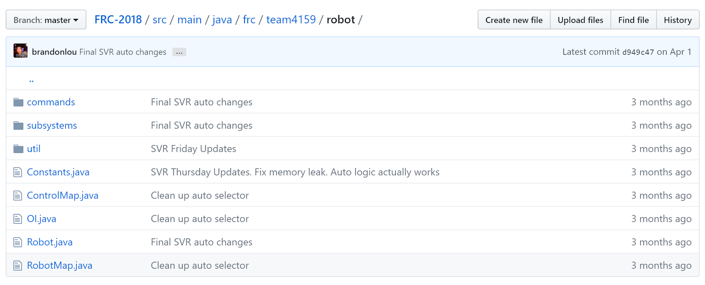|
 |:---:|
 |*Organization of our 2018 robot code*|
 
 Under this method, the robot code is divided into what the robot has and does ([subsystems](#subsystems)) and instruction for the robot ([commands](#commands)). We write functions for receiving joystick input and put these in the [Operator Interface (OI)](#operator-interface-oi) class. Fixed numbers ([constants](#constant-maps)) are separated into their own files, making them quick to find and easy to change. Meanwhile, the [main robot class](#main-robot-class) stays nice and clean, handling initializations or periodic functions that don’t fit in elsewhere.
 
 In particular, the rest of this article explains how and why we organize our code this way, which may be different from other teams. To get a better idea of how Command-based Programming works, take a look at WPILib’s explanation: [What is Command based programming?](http://wpilib.screenstepslive.com/s/currentCS/m/java/l/599732-what-is-command-based-programming)

## Subsystems

### What's a Subsystem?

|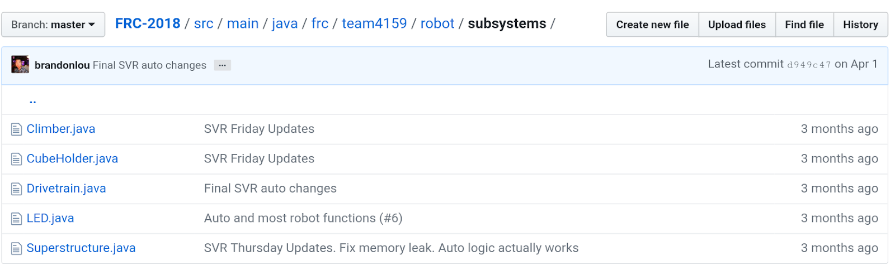|
|:---:|
|*Our different subsystems (2018)*|
 
 The robot is split into separate subsystems, and although this is usually defined by the people who design the robot, our general rule is that one unit should be a group of sensors and output devices (e.g. actuators or LEDs) that depend each other to perform actions, but each sensor and output can only belong to one subsystem. 
 
 For example, notice that our 2018 robot has a `CubeHolder` subsystem. This subsystem both picks up and shoots cubes, however, it cannot do both at once, since the motors that intake the cube are the same motors that shoot the cube. Thus, we awkwardly call it the `CubeHolder`, as opposed to making both a `CubeShooter` and `CubeIntake` class.
 By the way, you will break the code if you try to assign a single channel/ID to two motor controller objects. 
 
### What Goes in a Subsystem Class?

|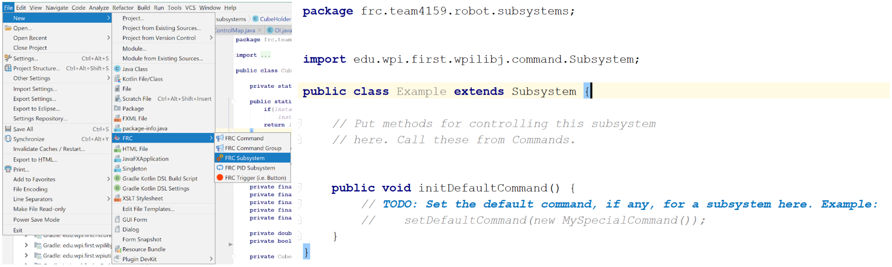|
 |:---:|
 |*Start with the FRC plugin provided template*|
 
 As mentioned in the overview, a subsystem class is comprised of what the subsystem has and what it does (not necessarily when it does something, though; we’ll go over that later). What this means is variables for any sensors or output devices that belongs to a subsystem should be assigned here, as well as other variables or constants that only belong to that one subsystem. Additionally, you’ll want to put initializations and calls to configuration/setup functions in the class constructor. 
 
 |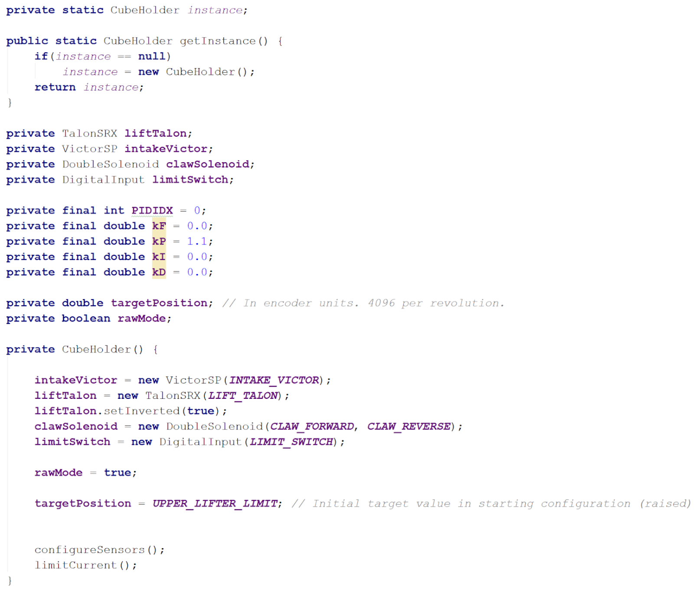|
 |:---:| 
 |*Examples of variables and other setup in subsystems (2018)*|
 
 Right below the constructor, we can start writing out subsystem functions: the programming for everything the subsystems will do. This is where functions that set actuator speeds, positions, or modes go, and it is essentially where you do most of the actual programming.
 
 Make sure to check out the documentation for the [WPILib API](http://first.wpi.edu/FRC/roborio/release/docs/java/) and the [CTRE API](http://www.ctr-electronics.com/downloads/api/java/html/index.html) for what functions to use for what motor controllers, sensors, etc. For more detail on how to program these, see the [electronics section](https://team4159.github.io/main_electronics_intro.html) of our site.
 
 |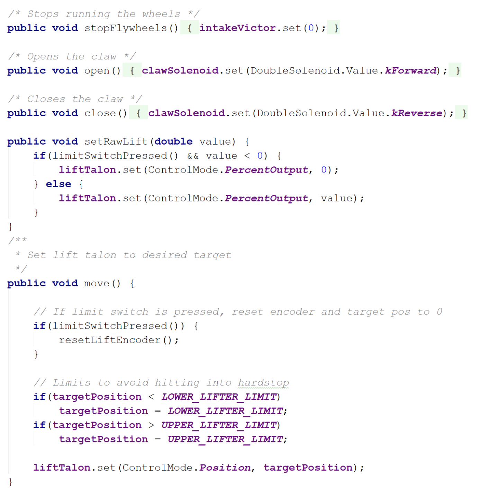|
 |:---:| 
 |*Examples of functions in subsystems (2018)*|
 
 Something to be careful of is that **this is not where code for joystick input goes.** The functions should not be programmed to depend on input from sources outside the class, but it's OK if the input (e.g. sensor input) is coming from within the class.
 
 When programming a lifter, for instance, it's alright to write a function that uses the reading of an encoder that has been initialized in the lifter's subsystem. On the other hand, you do not want include a function with something like, “if the joystick button is pressed, then stop.” The joystick input does not come from within the class and should not be programmed to do so. Instead, get rid of that “if” and just write out the stopping part. 
 
 So how do you get subsystem to actually do something? You've written out all the things that the subsystem _can_ do, but the functions won't run unless you tell them to—and that's where commands come in. 
 
## Commands
If you want your elevator subsystem to start lifting once the driver presses a button, or you want some LEDs to flash wildly 15 seconds before the end of a match, you'll want to program this in an FRC command class. 

Commands are where you tie in subsystem functions with external input such as match time, controller input, or another subsystem. In a sense, commands are made up of statements to “activate” subsystem functions.

We’ll go over a few things here, but starting out with the FRC Command template should give a pretty good idea of what needs to go in a command. Read the [Creating Simple Commands](http://wpilib.screenstepslive.com/s/currentCS/m/java/l/599737-creating-simple-commands) article for more details and examples.

### Teleoperated Period Commands
The teleoperated period (A.K.A. teleop) is when human drivers take control over the robot. Of the two programmable robot modes, this is usually the easier, more straight-forward mode to program.

Before anything else, be sure list out what subsystems the command will use in the command’s constructor using the `requires()` function.

|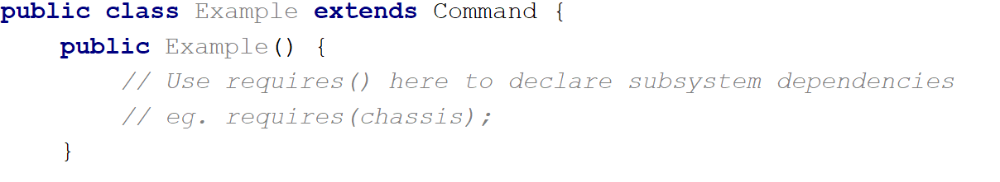|
 |:---:| 
 |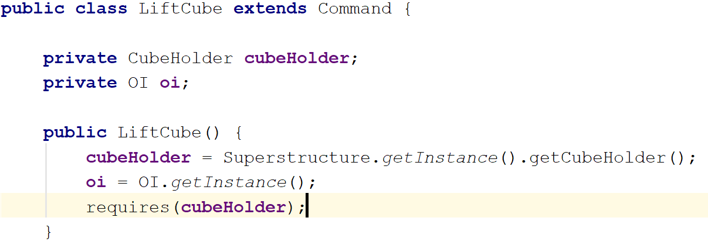|
 |*Use the `requires()` function to declare subsystem dependencies. In the case that a certain command needs functions from more than one subsystem, use `requires()` again for each additional subsystem.*|
 
 Next up, you actually write what the command does: the `execute()` function runs over and over again as long as the command hasn't ended or been interrupted. Here, you can put calls to a subsystem’s functions or add conditionals as you see fit, making sure to define an ending condition in `isFinished()`.
 
 |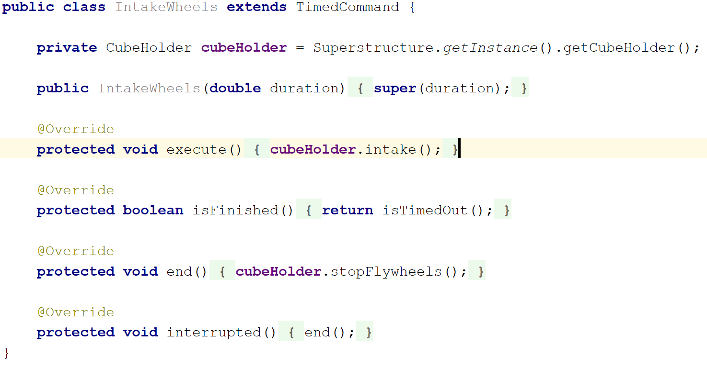|
 |:---:|
 |*An example of a command from our 2018 robot. It calls `intake()` from the `cubeHolder` class.*|
 
 But what if you don’t want a command to end? You might have noticed that it says to “set the default command” under `initDefaultCommand()` at the bottom of a subsystem class . A [default command](https://wpilib.screenstepslive.com/s/currentCS/m/java/l/599742-default-commands) is what the subsystem uses when there is no other command to run. Because of that, we generally use this for movements that continually need input, for example, the controlling the drivetrain or moving a manually controlled elevator. 
 
 |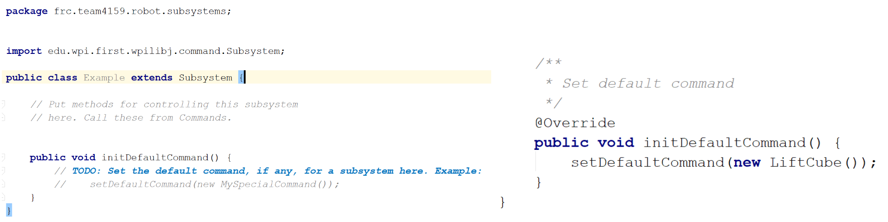|
  |:---:| 
  |*`initDefaultCommand()` function for setting the default command. Unlike the example to the right (2018 robot), you should probably include “default” in the command name to avoid confusion.*|
  
  But say you want a quick-lift command for your robot, so that the lifter goes to a certain height at a single button press. For these situations, you’d make a new command for each specific action. Then, these commands would be activated with controller input through the OI class constructor, which we discuss further down the page ([↓](#operator-interface-oi)). The advantage of this is that these commands can be also be used for the autonomous period, which may help to keep code clean, as illustrated in [this article](http://wpilib.screenstepslive.com/s/currentCS/m/java/l/599740-running-commands-during-the-autonomous-period).
  
  In past years, though not as versatile, we chose to use default commands as a subsystem’s sole command during teleop. In this case, there would be only one command during teleop, and any other command would be just for the autonomous period. Arguably, this isn’t the best practice for utilizing commands; it’s just what we happened to learn first, and we haven’t run into any issues with this method.
  
  Something that’s important to note is that we never _directly_ call `button` and `joystick` class methods here in the default command class. Instead, we code all of that in the separate OI class. To keep things simple for now, everything followed by `oi.` is just the state of a certain button, yielding `true` if it’s pressed.
  
  |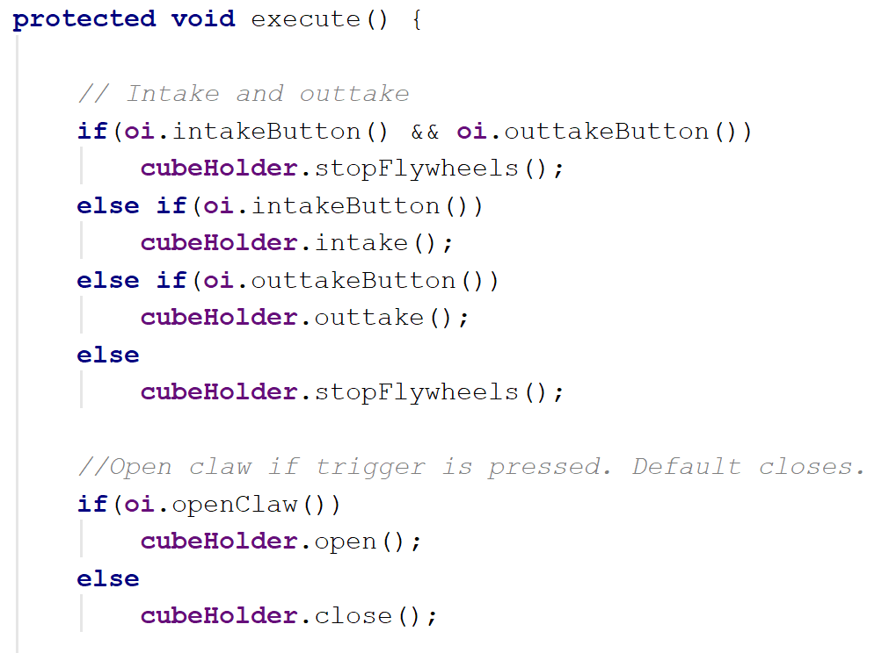|
  |:---:| 
  |*Example of a teleop command for our 2018 `CubeHolder` subsystem.*|
  
### Autonomous Period Commands
The autonomous period (A.K.A. auto) makes up the first 15 seconds of each match, during which the robot has to move without human input. A large part of what makes programming for auto tricky is that moving autonomously requires an increased use of sensors, calibration, and fancy algorithms.

Of course, there’s a lot of potential to autonomous programming. In fact, autonomous features are often integrated into subsystems and used during the teleop as well. However, if you’re interested in these algorithms and theories, we’d recommend you look in the control systems section of our site, as this section here only covers how we initialize simple commands for auto.

Programing autonomous commands is very much the same as it is for teleop commands; after all, as long as the command does not rely on controller input, the command is interchangeable between teleop and auto. Scroll down to the bottom of the [Running Commands During the Autonomous Period](http://wpilib.screenstepslive.com/s/currentCS/m/java/l/599740-running-commands-during-the-autonomous-period) article, and you’ll see that the difference lies in how to start the command.

Note that you must create a new Command _object_, then initialize it with an already-complete command that you want to run (look below for an example). It will start running when the Command class method, `.start()`, is called.

|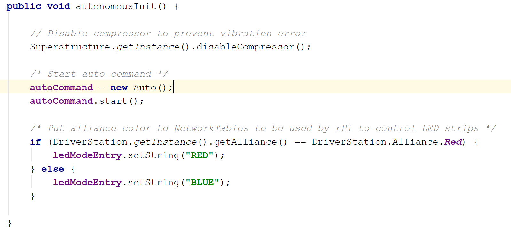|
  |:---:| 
  |*Example from our 2018 robot. We chose to initialize `autoCommand` in `autonomousInit()`. `autoCommand` is the new Command object, and `Auto` is the command that we want to run.*|
  
### Command Groups 
Often times, you’ll want a series of commands to go off at once, especially in autonomous. You could try coding all the functions you need into one command, but a more flexible and convenient way to go about this is to use a command group.

A command group allows you to order and sequence commands using the functions `addSequential()` and `addParallel()`. You can find more a more in-depth explanation [here](http://wpilib.screenstepslive.com/s/currentCS/m/java/l/599738-creating-groups-of-commands).

|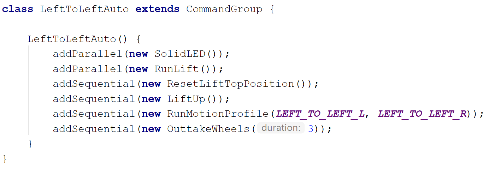|
  |:---:| 
  |*Example of a command group for auto (2018). Use functions `addParallel()` and `addSequential()` in the constructor of the command group.*|
  
  Because it is a subclass of the command class, you can still treat it as a command. This means if you want to run a command group, you would do the same thing as you would for a normal command: initialize it as a Command, then use the Command method `.start()` to run the command group.

## Operator Interface (OI)
By now you’re probably sick of hearing, “But this isn’t where you put joystick input,” and maybe you're also wondering why “OI” is sprinkled all over the code.

What the Operator Interface class does is it handles joystick and button input. This is where you can decide which buttons go to which commands and how a button should activate a command. All joystick and other controller objects should be made here, along with functions to return joystick or button values.

|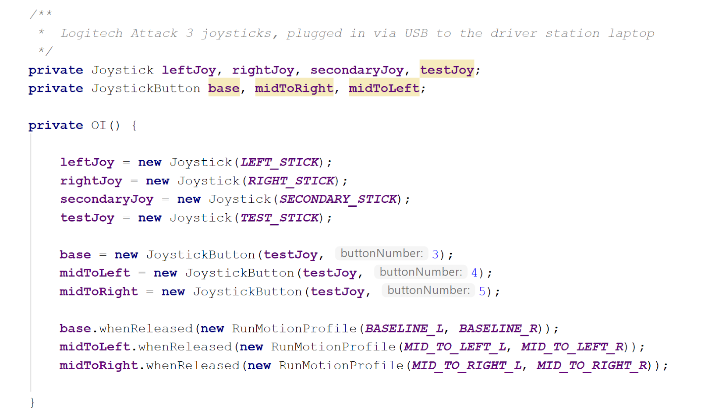|
|:---:|
|*Example of `Joystick`/`Button` objects used in the OI class to run commands. See the [WPILib](https://wpilib.screenstepslive.com/s/currentCS/m/java/l/599739-running-commands-on-joystick-input) article for more detail.*|

The standard method of linking commands to controller input is to activate the command through some button object, as shown above.  However, for commands that need the value of a joystick axis (and all default commands, for that matter), you must make use of accessor methods.

|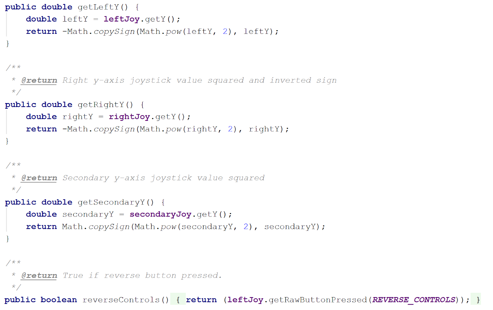|
|:---:|
|*Examples of accessor methods in the OI class. The Math class methods, `.pow` and `.copySign`,  are used to square the axis value, essentially making the joystick less sensitive and easier to control. For buttons in default commands, use `Joystick` class methods for button states.*|

In the example above, we use `.getRawButtonPressed()`, but there is also `.getRawButton()`, `.getRawButtonReleased()`, and another set of methods for the joystick trigger. Check out the [documentation](http://first.wpi.edu/FRC/roborio/release/docs/java/) for more detail on how these methods are used.

|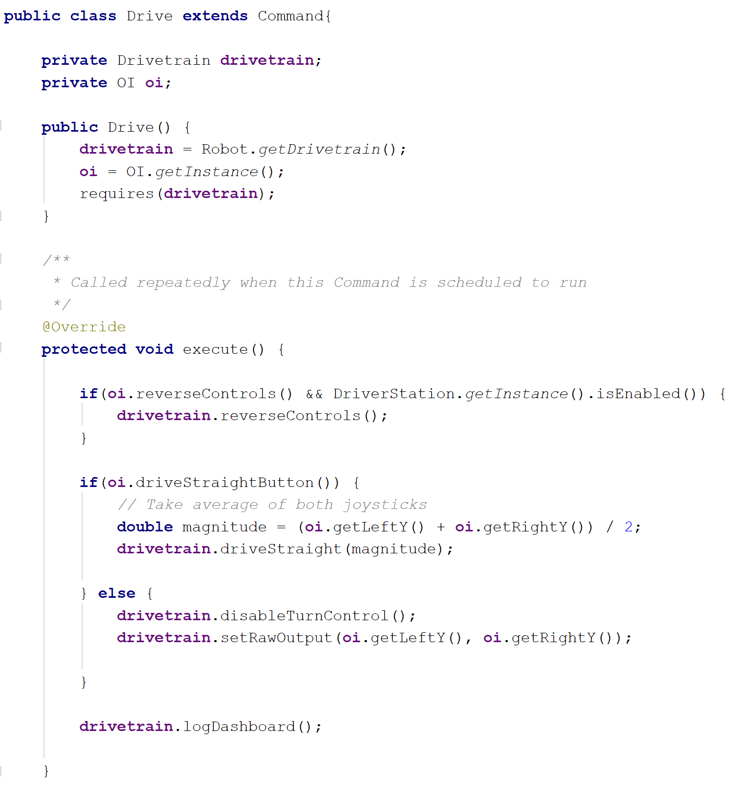|
|:---:|
|*Example of how we use OI class methods in default commands.*|

## Constant Maps
Under the pressure of competition season, you reeeaally don’t have time to be digging around the code after you forget which wire goes where or which button does what.

||
|:---:|
|*See those grey-boxed terms? In [IntelliJ](https://www.jetbrains.com/idea/), parameter hints are turned on by default (and that’s one reason why we recommend using IntelliJ as your IDE), but your partner skimming over the code on GitHub won’t see that, and they might have no idea what “3” means.*|

That’s why, in good coding style, we assign these port numbers, buttons, and IDs to variables, which we keep in separate files. In addition to looking neat, this makes wiring and buttons simple to look up and change.

|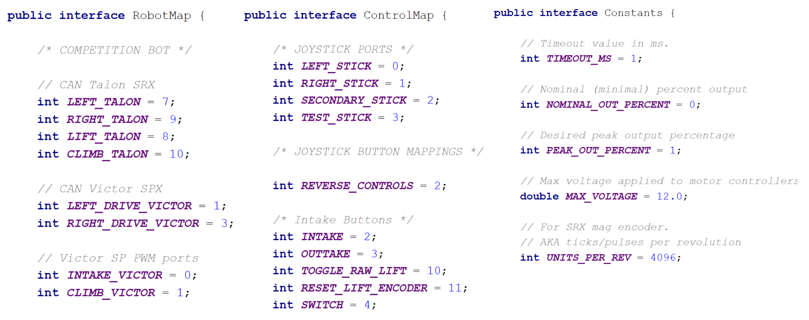|
|:---:|
|*A few examples of the what what we use constant maps for. Technically they’re not constants, but ehhh it’s close enough.*|

**RobotMap** is where we keep Roborio PWM port numbers, CAN IDs, PCM channels, and other wiring assignments for sensors and whatnot—it’s super useful when rewiring needs to happen. 

**ControlMap** is where we keep joystick ports and button assignments, because yes, you and the drivers will end up forgetting the controls.

**Constants** is where we throw any numbers we don’t have a place for. Ideally, we try to keep other constants, like tuning constants, within their respective classes, but if they’re universal, in the sense that they don’t change across subsystems, we like keep them here.

## Main Robot Class
So we’ve gone through pretty much every basic type of file you’ll have in your robot code folder, except for the main robot class. So what does it do anyway? If you’re following the Command-based robot model properly, the answer should be not much.

There are functions that are set up to run on initialization or periodically, depending on the game mode. Here are a few examples:

* `robotInit()`: called right when the robot starts up.
* `teleopPeriodic()`: runs over and over again when the robot is in teleop mode.
* `disabledPeriodic()`: runs when the robot is on, but disabled. 
* `testPeriodic()`: runs when the robot is in test mode.
* `autonomousInit()`: runs at the start of auto. We recommend initializing auto commands in `autonomousInit()`, as opposed to `robotInit()`, so the robot has a chance to receive game data first. 

|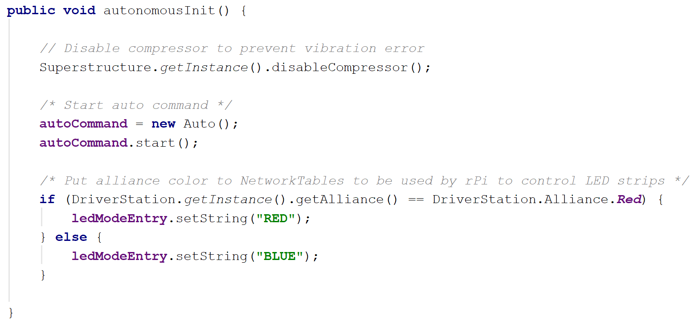|
|:---:|
|*An example of what we do at the start of the autonomous period. `Auto` is a command that contains other command groups to choose from.*|

Really, you can do anything with these functions, like zero sensors or print statements, but just know there's usually a better place. Keeping code out of the main robot function makes for easier navigation and bug-fixing.

Of course there is code that _does_ need to go in the main robot class. As mentioned earlier, this is where you put code to start auto commands. Other than that, there's going to be at least one instance of a subsystem and an instance of the OI class.

|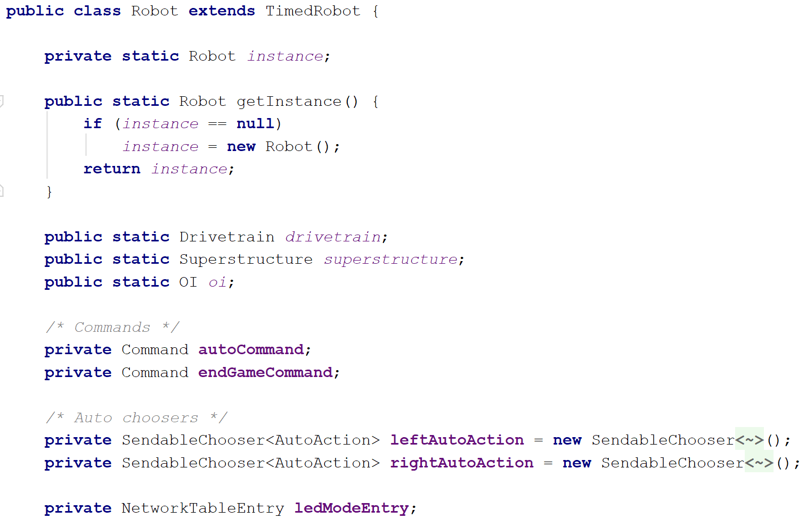|
|:---:|
|*Objects declared and initialized in the main robot class.*|

You could declare and initialize all subsystems in the main robot class, but we prefer to wrap our subsystems within another subsystem class named `Superstructure`, which also deals with code for the air compressor.

||
|:---:|
|*Within this `Superstructure` subsystem class, we call the other subsystems’ `.getInstance()` method.*|

Anyway, that's all we have here for the organization of our robot code. Again, we don't cover all the specifics here, so check out [WPILib’s programming sections](http://wpilib.screenstepslive.com/s/currentCS/m/java) and [documentation](http://first.wpi.edu/FRC/roborio/release/docs/java/) for more details and explanations. Also, feel free to take a look at our robot code in its entirety on our [GitHub](https://github.com/Team4159).

`Message from Helen:`
If you've read through this entire thing, all 2400+ words, I applaud you. Wow. Good job for making it all the way down here, and thanks for putting up with my terrible writing. Be sure to send me a cookie and some feedback, be it pointing out mistakes in my knowledge or nit-picking at my grammer, so future readers (if there are any ; u ; ) don't have to suffer as much as you did. Thanks again and happy programming!

