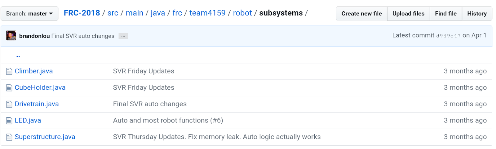
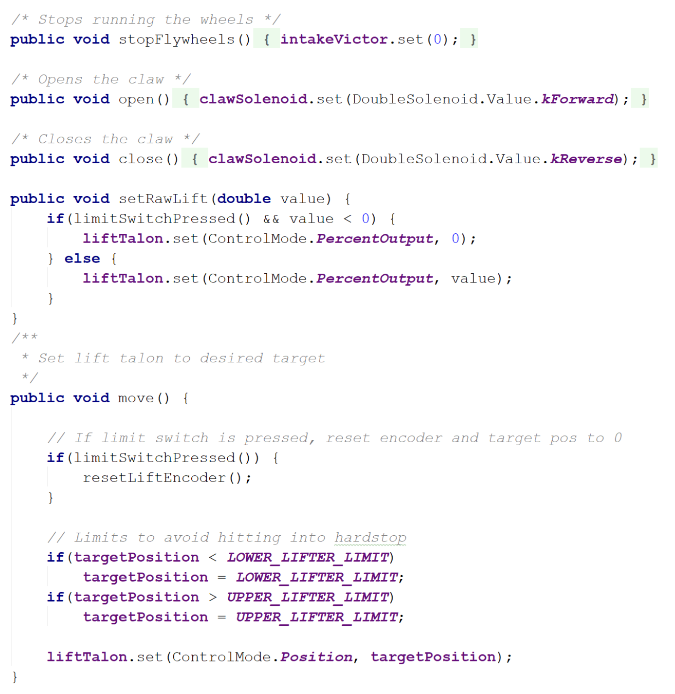
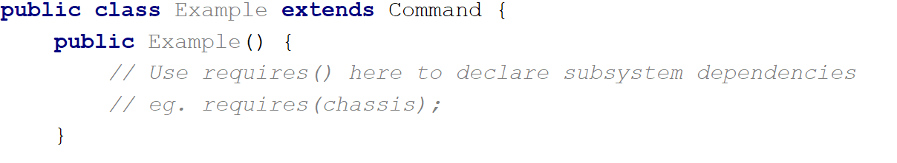
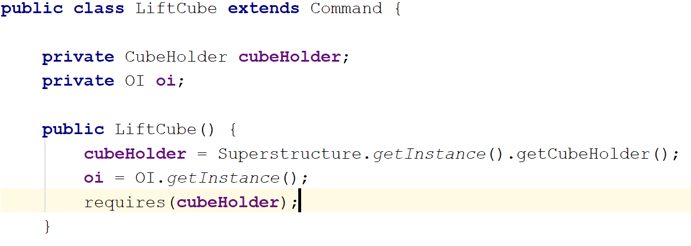
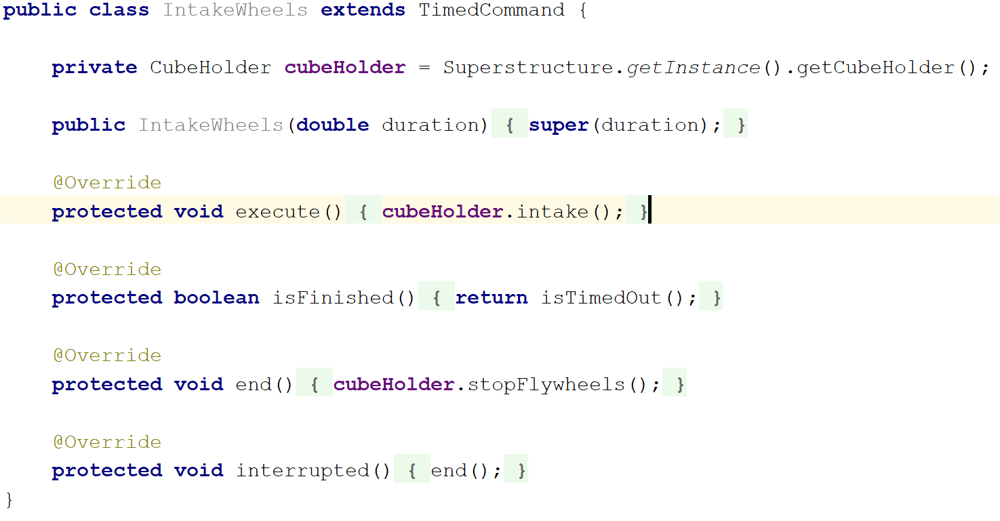
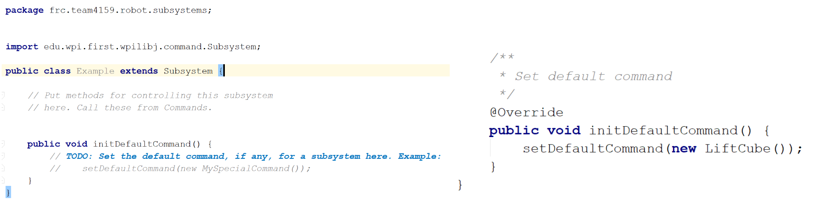
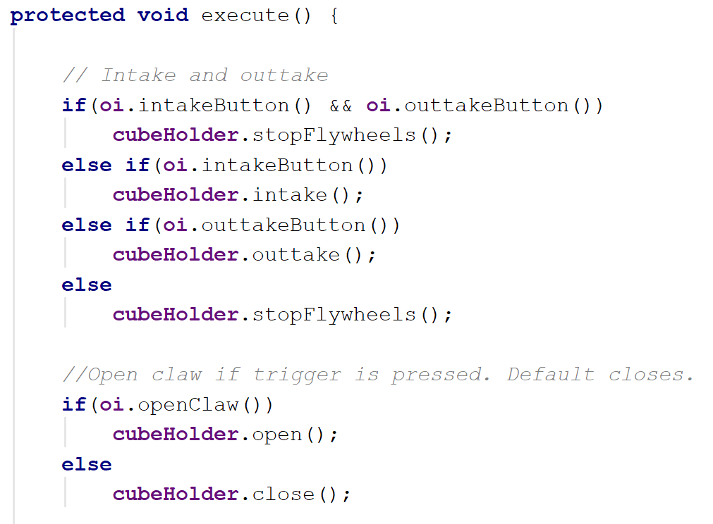
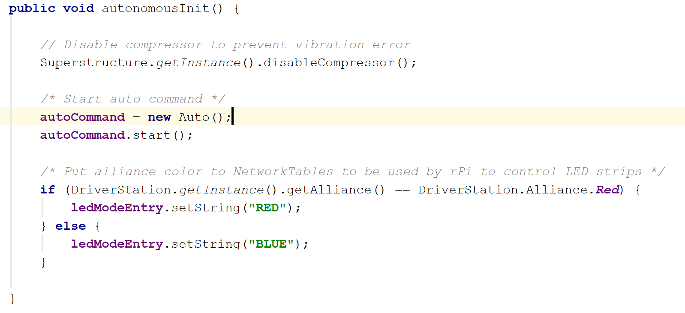
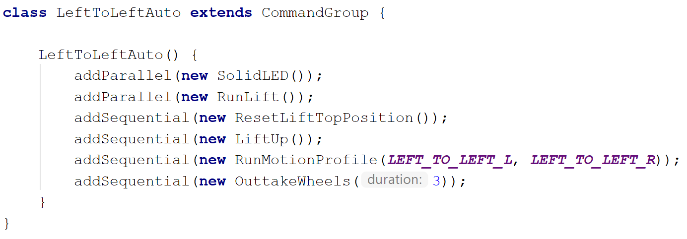

## Overview 

We follow the Command-based robot model to organize our robot code. This method of organization separates the robot code into subsystems and commands, and it allows us to utilize built-in support from WPILib.

 ||
 |:---:|
 |*Organization of our 2018 robot code*|
 
 Under this method, the robot code is divided into what the robot has and does ([subsystems](#subsystems)) and instruction for the robot ([commands](#commands)). We write functions for receiving joystick input and put these in the [Operator Interface (OI)](#operator-interface-(oi)) class. Fixed numbers ([constants](#constants)) are separated into their own files, making them quick to find and easy to change. Meanwhile, the [main robot class](#main-robot-class) stays nice and clean, handling initializations or periodic functions that don’t fit in elsewhere.
 
 In particular, the rest of this article explains how and why we organize our code this way, which may be different from other teams. To get a better idea of how Command-based Programming works, take a look at WPILib’s explanation: [What is Command based programming?](http://wpilib.screenstepslive.com/s/currentCS/m/java/l/599732-what-is-command-based-programming)

## Subsystems

### What's a Subsystem?

||
|:---:|
|*Our different subsystems (2018)*|
 
 The robot is split into separate subsystems, and although this is usually defined by the people who design the robot, our general rule is that one unit should be a group of sensors and output devices (eg. actuators or LEDs) that depend each other to perform actions, but each sensor and output can only belong to one subsystem. 
 
 For example, notice that our 2018 robot has a `CubeHolder` subsystem. This subsystem both picks up and shoots cubes, however, it cannot do both at once, since the motors that intake the cube are the same motors that shoot the cube. Thus, we awkwardly call it the `CubeHolder`, as opposed to making both a `CubeShooter` and `CubeIntake` class.
 By the way, you will break the code if you try to assign a single channel/ID to two motor controller objects. 
 
### What Goes in a Subsystem Class?

||
 |:---:|
 |*Start with the FRC plugin provided template*|
 
 As mentioned in the overview, a subsystem class is comprised of what the subsystem has and what it does (not necessarily when it does something, though; we’ll go over that later). What this means is variables for any sensors or output devices that belongs to a subsystem should be assigned here, as well as other variables or constants that only belong to that one subsystem. Additionally, you’ll want to put initializations and calls to configuration/setup functions in the class constructor. 
 
 ||
 |:---:| 
 |*Examples of variables and other setup in subsystems (2018)*|
 
 Right below the constructor, we can start writing out subsystem functions: the programming for everything the subsystems will do. This is where functions that set actuator speeds, positions, or modes go, and it is essentially where you do most of the actual programming.
 
 Make sure to check out the documentation for the [WPILib API](http://first.wpi.edu/FRC/roborio/release/docs/java/) and the [CTRE API](http://www.ctr-electronics.com/downloads/api/java/html/index.html) for what functions to use for what motor controllers, sensors, etc. For more detail on how to program these, see the [electronics section](https://team4159.github.io/main_electronics_intro.html) of our site.
 
 ||
 |:---:| 
 |*Examples of functions in subsystems (2018)*|
 
 Something to be careful of is that **this is not where code for joystick input goes.** The functions should not be programmed to depend on input from sources outside the class, but it's OK if the input (eg. sensor input) is coming from within the class.
 
 When programming a lifter, for instance, it's alright to write a function that uses the reading of an encoder that has been initialized in the lifter's subsystem. On the other hand, you do not want include a function with something like, “if the joystick button is pressed, then stop.” The joystick input does not come from within the class and should not be programmed to do so. Instead, get rid of that “if” and just write out the stopping part. 
 
 So how do you get subsystem to actually do something? You've written out all the things that the subsystem _can_ do, but the functions won't run unless you tell them to—and that's where commands come in. 
 
## Commands
If you want your elevator subsystem to start lifting once the driver presses a button, or you want some LEDs to flash wildly 15 seconds before the end of a match, you'll want to program this in an FRC command class. 

Commands are where you tie in subsystem functions with external input such as match time, controller input, or another subsystem. In a sense, commands are made up of statements to “activate” subsystem functions.

We’ll go over a few things here, but starting out with the FRC Command template should give a pretty good idea of what needs to go in a command. Read the [Creating Simple Commands](http://wpilib.screenstepslive.com/s/currentCS/m/java/l/599737-creating-simple-commands) article for more details and examples.

### Teleoperated Period Commands
The teleoperated period (A.K.A. teleop) is when human drivers take control over the robot. Of the two programmable robot modes, this is usually the easier, more straight-forward mode to program.

Before anything else, be sure list out what subsystems the command will use in the command’s constructor using the `requires()` function.

||
 |:---:| 
 ||
 |*Use the `requires()` function to declare subsystem dependencies. In the case that a certain command needs functions from more than one subsystem, use `requires()` again for each additional subsystem.*|
 
 Next up, you actually write what the command does: the `execute()` function runs over and over again as long as the command hasn't ended or been interrupted. Here, you can put calls to a subsystem’s functions or add conditionals as you see fit, making sure to define an ending condition in `isFinished()`.
 
 ||
 |:---:|
 |*An example of a command from our 2018 robot. It calls `intake()` from the `cubeHolder` class.*|
 
 But what if you don’t want a command to end? You might have noticed that it says to “set the default command” under `initDefaultCommand()` at the bottom of a subsystem class . A [default command](https://wpilib.screenstepslive.com/s/currentCS/m/java/l/599742-default-commands) is what the subsystem uses when there is no other command to run. Because of that, we generally use this for movements that continually need input, for example, the controlling the drivetrain or moving a manually controlled elevator. 
 
 ||
  |:---:| 
  |*`initDefaultCommand()` function for setting the default command. Unlike the example to the right (2018 robot), you should probably include “default” in the command name to avoid confusion.*|
  
  But say you want a quick-lift command for your robot, so that the lifter goes to a certain height at a single button press. For these situations, you’d make a new command for each specific action. Then, these commands would be activated with controller input through the OI constructor. (You might want to come back to this after reading about the [Operator Interface (OI)](#operator-interface-(oi)).) The advantage of this is that these commands can be also be used for the autonomous period, which may help to keep code clean, as illustrated in [this article](http://wpilib.screenstepslive.com/s/currentCS/m/java/l/599740-running-commands-during-the-autonomous-period).
  
  In past years, though not as versatile, we chose to use default commands as a subsystem’s sole command during teleop. In this case, there would be only one command during teleop, and any other command would be just for the autonomous period. Arguably, this isn’t the practice for utilizing commands; it’s just what we happened to learn first, and we haven’t run into any issues with this method.
  
  Something that’s important to note is that we never directly call button and joystick methods here. Instead, we code all of that in the separate OI class, which we discuss further down the page ([↓](#operator-interface-(oi))). To keep things simple for now, everything followed by `oi.` is just the state of a certain button, yielding `true` if it’s pressed.
  
  ||
  |:---:| 
  |*Example of a teleop command for our 2018 `CubeHolder` subsystem.*|
  
### Autonomous Period Commands
The autonomous period (A.K.A. auto) makes up the first 15 seconds of each match, during which the robot has to move without human input. A large part of what makes programming for auto tricky is that moving autonomously requires an increased use of sensors, calibration, and fancy algorithms.

Of course, there’s a lot of potential to autonomous programming. In fact, autonomous features are often integrated into subsystems and used during the teleop as well. However, if you’re interested in these algorithms and theories, we’d recommend you look in the control systems section of our site, as this section here only covers how we initialize simple commands for auto.

Programing autonomous commands is very much the same as it is for teleop commands; after all, as long as the command does not rely on controller input, the command is interchangeable between teleop and auto. Scroll down to the bottom of the [Running Commands During the Autonomous Period](http://wpilib.screenstepslive.com/s/currentCS/m/java/l/599740-running-commands-during-the-autonomous-period) article, and you’ll see that the difference lies in how to start the command.

Note that you must create a new Command _object_, then initialize it with an already-complete command that you want to run (look below for an example). It will start running when the Command class method, `.start()`, is called.

||
  |:---:| 
  |*Example from our 2018 robot. We chose to initialize `autoCommand` in `autonomousInit()`. `autoCommand` is the new Command object, and `Auto` is the command that we want to run.*|
  
###Command Groups
Often times, you’ll want a series of commands to go off at once, especially in autonomous. You could try coding all the functions you need into one command, but a more flexible and convenient way to go about this is to use a command group.

A command group allows you to order and sequence commands using the functions `addSequential()` and `addParallel()`. You can find more a more in-depth explanation [here](http://wpilib.screenstepslive.com/s/currentCS/m/java/l/599738-creating-groups-of-commands).

||
  |:---:| 
  |*Example of a command group for auto (2018). Use functions `addParallel()` and `addSequential()` in the constructor of the command group.*|
  
  Because it is a subclass of the command class, you can still treat it as a command. This means if you want to run a command group, you would do the same thing as you would for a normal command: initialize it as a Command, then use the Command method `.start()` to run the command group.

## Operator Interface (OI)

## Constants

### Control Map

### Robot Map

## Main Robot Class
